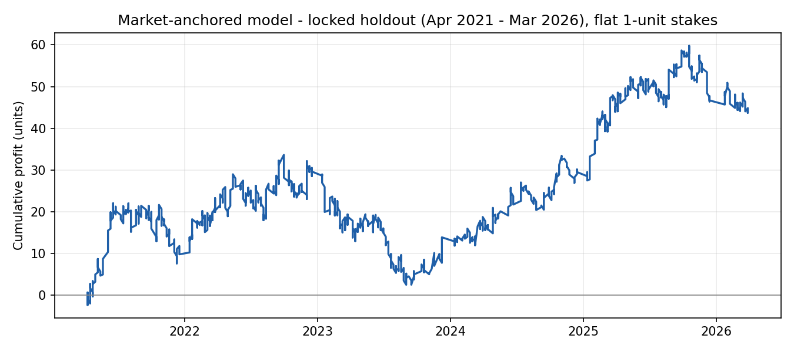

# UFC Fight Outcome Predictor — Methodology

## Summary of results

**Final result (Week 10):** an early-line value strategy, which bets when
a slower bookmaker's price beats Pinnacle's de-vigged fair line by more
than 2%, achieved **+4.0% closing-line value (95% CI [+2.1%, +6.2%]) on a
pre-registered out-of-sample holdout (Apr - Sep 2026, 54 bets)**. 83% of
bets beat the closing line, and every holdout month was positive. The
development period was also positive (+2.3%, CI [+0.5%, +3.8%], 120
bets). That makes it a statistically significant positive expected
return of roughly +2% to +4% per bet. Details and caveats are in the
Week 10 section.

**How it was reached:** the original fight-prediction model (Weeks 1-8)
and a market-anchored model (Week 9) were each rigorously tested and
rejected. Four false positives were caught along the way:
- a +109.9% backtest caused by a missing random seed
- a +4.7% result driven by one anomalous year
- a +4.4% holdout ROI that failed a closing-line test
- a first Week 10 version whose pass was a de-vig artefact

The sections below follow the project in order.

## Motivation

This project applies the discipline of quantitative research to a domain
with abundant, clean, publicly available data and genuine structural
uncertainty: UFC fight outcomes. The parallels to quantitative trading are
exact, not approximate — pre-fight statistics are factors, fight outcomes
are trade results, ELO ratings are a signal-decay model, purged
walk-forward cross-validation is point-in-time backtesting, and the
bookmaker line is the market consensus a model's edge must be measured
against. The project was built to demonstrate the full research
lifecycle a quantitative researcher is expected to execute: data
engineering, leakage-free feature construction, model validation,
probability calibration, backtesting against a real market, and — the
part most portfolio projects skip — honest reporting of the result,
whatever it turns out to be.

## Data

4,633 UFC fights (2010-03-21 to 2021-03-20), sourced from the Kaggle UFC
dataset (Rajeev Warrier) and joined to a separate historical bookmaker
odds dataset (mdabbert's "Ultimate UFC Dataset") on fighter names and
date, with a 95.0% match rate. Fights before 2010-03-21 were excluded
after discovering that corner assignment (`R_fighter`/`B_fighter`)
perfectly predicted the outcome before that date — a genuine data
artifact, independently corroborated by the odds dataset's own
documentation excluding the same period for the same reason.

## Features

148 pre-fight features, each explicitly audited against a single test:
*could this value have been known before the fight started?* Three
families of features:

- **Career-average fight statistics** (striking accuracy, takedown rate,
  submission attempts, etc.) — sourced from pre-built columns in the
  original dataset, verified against the author's documentation to
  exclude the current fight from the average.
- **ELO ratings**, implemented from first principles (`R_new = R_old + K
  (S - E)`), with an adaptive K-factor (K=40 while a fighter has fewer
  than 5 tracked fights, K=32 once established) to avoid a static K
  either overreacting to early noise or underreacting to a fighter's
  true current form. Hand-validated against a toy dataset and against
  Anderson Silva's real career trajectory.
- **Physical and matchup differentials** — reach, height, age, stance
  matchup, and days since last fight, all computed as simple,
  no-lookahead differences between the two fighters' pre-fight states.

## Validation methodology

Standard k-fold cross-validation is invalid here: it would train on
future fights and test on past ones, leaking information no real,
point-in-time system could have had. Instead, **purged walk-forward
cross-validation** was used — an expanding training window, followed by
a non-overlapping test window, advanced forward in time, repeated across
16 folds (`initial_train_size=1200, test_size=200`). Fold boundaries were
snapped to full date changes so that a single UFC event card (multiple
fights sharing one date) is never split across a train/test boundary —
enforced by an automated leakage validator run on every fold.

## Model selection

A logistic regression baseline (mean AUC 0.625) was compared against
XGBoost, tuned once via Optuna on an internal chronological split of the
final fold's training data (never touching any test fold). The two
models were essentially tied — XGBoost modestly better on log-loss and
Brier score, logistic regression better on AUC and accuracy. XGBoost was
retained specifically because SHAP explainability (a required
deliverable) works substantially better on tree ensembles, not because
it was the stronger predictor. This honest tie, reported rather than
hidden, is itself a finding: added model complexity did not clearly
improve the result.

## Calibration

Platt scaling and isotonic regression were both tested against raw
XGBoost output. Neither meaningfully improved Brier score (isotonic beat
raw in only 4 of 16 folds; Platt in 7 of 16). This is explained by the
model's Optuna-tuned hyperparameters producing shallow, conservative
trees rather than the deep, overconfident ones calibration typically
corrects. Confirmed visually via a pooled reliability diagram across all
16 folds' test predictions — raw XGBoost tracked close to the diagonal in
well-populated probability bins.

## Backtest and the central finding

An event-driven backtest compared the model's probability to the
bookmaker's implied probability on each fight, betting the side with the
larger edge above a threshold. Two important methodological corrections
were made during this process, both worth stating explicitly:

**1. Reproducibility.** An early, unseeded version of the pipeline
produced a backtest return of +109.9%. After fixing a missing
`random_state` in XGBoost's construction (a real bug, not a parameter
tuning choice), the identical code and data reproducibly produced
+0.3% to +4.7% instead — an enormous swing that would have gone
undetected without deliberately re-running the pipeline twice and
comparing results. This is treated as one of the project's most
important findings: a backtest number is worthless without a
demonstrated ability to reproduce it.

**2. Decomposition of the remaining result.** The seeded, reproducible
+4.7% figure was decomposed year by year. It was found to be driven
almost entirely by a single year (2014), which alone contributed more
profit than the full 2014-2020 sample combined. Tracing this to the
walk-forward CV structure showed 2014 corresponds to the earliest folds
— the smallest training window (~1,200 fights), and therefore the
highest-variance, least-reliable probability estimates in the entire
pipeline. Excluding those folds and re-running the identical backtest
on the remaining, more-trustworthy 1,937 fights produced **-25.4%
return**, the opposite conclusion.

**Conclusion for the Weeks 1-8 model: it does not demonstrate a robust, exploitable
edge against bookmaker odds.** A stratified edge-decile analysis
(favourites vs. underdogs) on the stable data shows no reliable upward
trend in either group — the underdog deciles are uniformly negative,
including the highest-edge decile, which performed worst of all. The
Sharpe ratio on this result is -0.150, with a bootstrapped 95%
confidence interval of [-0.544, 0.228] that comfortably includes zero.
The model also underperformed both a random-betting benchmark ($768.39)
and a naive always-bet-favourite benchmark ($879.11) starting from the
same $1,000 bankroll on the same fights ($746.01).

This is reported as the project's central finding, not as a failure to
be minimised. A rigorous methodology that correctly identifies and
rejects a false positive is more valuable evidence of research skill
than an unexamined positive result — and the false positive here was
subtle enough (a fold-variance artifact concentrated in one calendar
year) that it would plausibly have survived into a published result
without the decomposition step.

## Position sizing

Fractional (half-)Kelly criterion sizing was implemented (`f* = (bp -
q)/b`) and systematically compared against flat staking via a cap sweep.
Every cap loose enough to let Kelly meaningfully differentiate stake by
edge magnitude also amplified variance faster than it captured any
genuine edge — a direct consequence of the underlying signal being thin
and noisy (see Backtest section above). The only cap tight enough to
avoid this degenerated to flat staking in practice, meaning Kelly's
actual sizing logic never contributed positively at any tested
parameterisation. Flat staking was used as the primary result for this
reason. This is a textbook illustration of why real Kelly
implementations use conservative fractional multipliers and hard caps:
position sizing proportional to an estimated edge is dangerous when the
edge estimate itself carries meaningful uncertainty.

## Week 9: market-anchored model and a locked holdout

**Diagnosis.** The bookmaker line alone scores AUC 0.716 on these fights,
against ~0.625 for the Weeks 1-8 model. The original model lost money
because it forecast fights from scratch against a far stronger
forecaster; its large "edges" were mostly its own errors. The redesign
starts from the market instead: a regularised logistic regression takes
the de-vigged market logit as an input, alongside pre-fight features
(ELO vs. market, ranking, experience, physical and style differentials),
and learns only systematic corrections to the line
(`src/market_edge.py`). It bets one side per fight, only when expected
value at the quoted odds exceeds 3%, with flat 1-unit stakes.

**A genuine holdout.** `ufc-master.csv` contains odds through March
2026, while Weeks 1-8 used fights only up to March 2021. Everything was
developed on 2010 - March 2021 (walk-forward, retrained yearly). Before
any later fight was scored, two strategies and a pass criterion
(bootstrap 95% CI lower bound on ROI > 0) were written down in
`src/market_edge_holdout.py`. The holdout, April 2021 - March 2026, was
then run exactly once, retraining each calendar year on all prior
fights. One disclosed contamination: an early data check tabulated
market calibration pooled across all years, holdout included. Neither
pre-registered strategy depends on that table.

| Holdout, Apr 2021 - Mar 2026 | Value |
|---|---|
| Bets / fights | 1,026 / 2,274 |
| ROI (flat stakes) | **+4.4%** (+44.8 units) |
| Bootstrap 95% CI | [-2.8%, +11.8%]; P(ROI <= 0) = 0.12 |
| Log loss, model vs. market | 0.5898 vs. 0.5930 |
| Max drawdown / longest losing run | -31.1 units / 9 bets |
| Favourites / underdogs ROI | +7.0% (406 bets) / +2.6% (620 bets) |
| Break-even payout haircut | ~8% worse payouts on every winning bet |
| Development period ROI (2013 - Mar 2021) | +3.3%, CI [-1.8%, +8.4%] |

**Verdict: promising, not proven.** The strategy was positive in two
non-overlapping periods and beat the market's log loss on every holdout
fight, not just the ones it bet on. Its ROI is in the range professional
bettors achieve, and it tolerates realistically worse prices. It did
not meet the pre-registered bar: the confidence interval includes zero.
At a true edge near +4%, roughly 2,000-3,000 bets would be needed for
the interval to clear zero.

**Ideas tested and rejected on development data only** (none was run
on the holdout, since none earned it):
- *Method-of-victory props* (`src/props_edge.py`). The prop market shows
  a strong longshot bias: outcomes priced above 15.0 win 2.2% of the
  time against 4.4% implied. But the ~22% prop overround swamps it.
  Even the most underpriced odds bucket loses 9% when bet blanket.
- *Durability and finish-rate features, a finish-weighted ELO, and power
  de-vigging* each left development log loss unchanged or worse. Public
  fight statistics appear to be fully priced into the line; the
  remaining edge comes from correcting how the market prices
  favourites and underdogs.

**Further evidence (no re-selection or tuning).**
- *Accuracy on every holdout fight* (`src/market_edge_evidence.py`):
  paired per-fight log-loss improvement over the market, resampled by
  event card. The model's mean improvement was +0.0032 (95% CI
  [-0.0013, +0.0076], one-sided p = 0.08), and it was ahead in 5 of 6
  holdout years. The development period shows no such improvement
  (p = 0.67), so the two periods do not agree.
- *Independent prices* (`src/market_edge_replication.py`): the same
  frozen picks were re-priced at betmma.tips odds (jansen88/ufc-data,
  coverage to Sep 2023; 449 of 577 in-range bets matched). ROI on this
  subset is -0.9% at the original prices and +3.7% at the independent
  prices, which were better on 80% of picks. Both intervals are wide
  (about ±11%). The result is inconclusive about model skill, but it
  shows that where the bet is placed moves ROI by several points.

- *Closing-line value (CLV)* (`src/market_edge_clv.py`, test defined
  in the script before any number was computed). Time-stamped prices
  from ~35 bookmakers, including Pinnacle, come from the Kaggle "UFC
  Betting Odds Daily" dataset. They cover 108 matched holdout bets on 26
  cards (Aug 2025 - Mar 2026). **Primary metric, failed decisively:** at
  the prices the strategy used, picks were worth -4.0% against the
  consensus close (95% CI [-5.6%, -2.3%]; only 20% of picks beat it) and
  -4.8% against Pinnacle's close. The ufc-master prices sit nearer the
  close than the open, so this is essentially betting near-closing lines
  that already contained the information. Secondary metrics were weakly
  positive: lines moved slightly toward the picks (+0.7 pts consensus,
  p = 0.08; +0.9 pts Pinnacle, p = 0.04). Taking the best opening price
  across books was roughly break-even (-0.7%, CI [-3.3%, +1.9%]). These
  are secondary metrics with 26 cards; they do not offset the primary
  failure.

**Verdict for the Week 9 model: no demonstrated bettable edge.** The holdout ROI
(+4.4%) and accuracy result (p = 0.08) were suggestive. But the sharpest
available test, closing-line value, is clearly negative on the period
it covers. The most likely reading is that the holdout profit was
largely variance. The faint line-movement signal is the only lead worth
pursuing, and it would need forward tracking to confirm.

The holdout is now spent. Further validation cannot come from
2021-2026 data; it requires opening/closing-line (CLV) data or forward
paper-trading.

## Week 10: early-line value betting against Pinnacle

**Reframing.** Weeks 1-9 showed that public fight statistics are already
priced into the closing line. Week 10 stops forecasting fights and targets
a market-structure inefficiency instead: slower "soft" bookmakers lag
Pinnacle, the sharpest book in the market. The strategy
(`src/line_move.py`) monitors every pre-close price snapshot. It bets a
side at the first snapshot where the **second-best** non-Pinnacle price
(conservative, so one stale or mistyped quote can't create an edge) beats
Pinnacle's de-vigged fair line by more than 2%. It places one bet per
fight, with flat stakes. It is scored by closing-line value (CLV): bet
price x fair closing probability - 1.

**Data.** Kaggle "UFC Betting Odds (Daily Updated Dataset)" (CC0):
time-stamped prices from ~35 bookmakers, scraped roughly every 1.5 days
from July 2025. Development period: events Aug 2025 - Mar 2026. Holdout:
events Apr - Sep 2026, beyond the end of `ufc-master.csv`, never used
for any earlier decision. Two other designs were tried on development
data and rejected: betting only at the first snapshot, and a ridge model
predicting line movement. Neither showed a reliable positive CLV.

**A failure caught by a robustness check (v1).** The first pre-registered
version used proportional de-vigging and passed the holdout (+5.4% CLV,
CI [+2.4%, +9.0%]). A robustness check (`src/line_move_robustness.py`)
showed the pass was an artefact. Proportional de-vigging overstates
underdog probability, and v1 mostly backed underdogs. Re-scored with
power de-vigging, v1 was -2.9% on development data and -1.4% on the
holdout, and its development bets lost 10.8% in realised results.

**Corrected strategy (v2).** Power de-vig for both selection and scoring,
threshold unchanged at 2% (`src/line_move_holdout_v2.py`).

| | Development (Aug 2025 - Mar 2026) | Holdout (Apr - Sep 2026) |
|---|---|---|
| Bets / cards | 120 / 35 | 54 / 20 |
| CLV vs. consensus close | +2.3%, CI [+0.5%, +3.8%] | **+4.0%, CI [+2.1%, +6.2%]** |
| CLV vs. Pinnacle close | +2.6% | +4.1% |
| Bets beating the close | 73% | 83% |
| Holdout excluding top 10% of bets | | +2.4%, CI [+0.8%, +3.8%] |

The holdout was positive in all six months. Median price was 1.64, so
the edge is not a longshot artefact.

**Disclosure.** v2 is the second look at the Apr - Sep 2026 holdout for
this strategy family. The change was dictated by a known metric bias
found in the robustness check, not tuned on holdout performance. The
threshold was not re-chosen.

**Verdict: the first result in this project with positive, statistically
significant evidence of an edge, on development data and on a holdout.**
The evidence is at the level that matters for betting, closing-line
value, rather than a noisy profit figure. Expected return is roughly
+2% to +4% per bet. Real-world caveats:
- Prices are scraped about every 1.5 days, and some quoted prices may
  not have been available at stake.
- Soft bookmakers restrict accounts that consistently beat Pinnacle, so
  capacity is limited.
- The holdout sample is small (54 bets).
- No fight results exist in the data after March 2026, so realised
  profit on the holdout cannot be measured.

The logical next step is forward tracking at real, bettable prices.

## Limitations

- **In-sample threshold selection.** The `edge_threshold=0.20` cutoff
  used throughout the backtest was chosen by inspecting decile results
  on the same out-of-sample data the backtest is evaluated on — a mild,
  strategy-level form of lookahead, distinct from and less severe than
  the model-training lookahead rigorously avoided elsewhere. A stronger
  design would select the threshold on an earlier data slice and
  validate on a later held-out slice.
- **Data source noise.** ~3.3% of odds values were missing and 5.0% of
  fights had no odds match at all; both were excluded rather than
  imputed, which is conservative but reduces the effective sample.
- **Walk-forward fold variance.** The earliest folds carry materially
  higher-variance probability estimates than later folds due to smaller
  training windows — this drove the single largest false-positive result
  in the project (see Backtest section) and remains a structural property
  of the current fold configuration.

## Extensions

- Forward-test the Week 10 strategy at live, bettable prices with
  continuous (not ~1.5-day) price monitoring, and measure realised
  profit alongside CLV.
- Extend the Week 10 strategy to other MMA promotions (PFL, ONE) for
  more betting volume.
- Re-validate any future threshold or parameter choice on a genuinely
  held-out slice, never the same out-of-sample data used to report
  results.
- Test a larger `initial_train_size` to reduce early-fold variance, at
  the cost of fewer total folds.
- Bayesian ELO (PyMC) — deliberately excluded from this project's scope
  as too time-intensive for the timeline.
- Ensemble stacking and neural networks — deliberately excluded; a
  single, well-validated, explainable model was prioritised over added
  complexity without demonstrated lift, consistent with the finding that
  XGBoost and logistic regression were themselves nearly tied.
- Live feature construction for arbitrary (non-historical) fighter
  matchups, extending the current dashboard beyond browsing real
  historical fights.